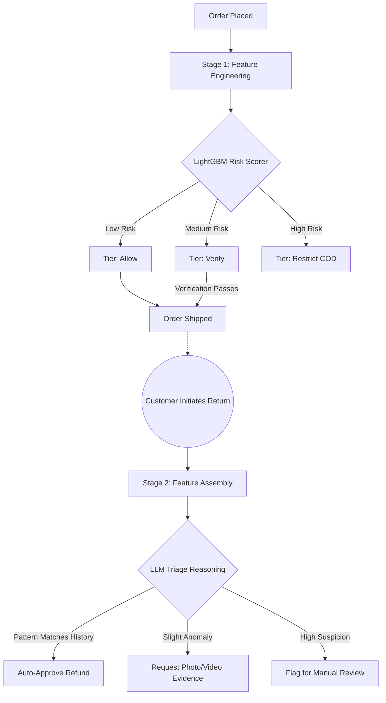

# Architecture

The system follows a two-stage pipeline:

```mermaid
graph TD
    A[Order Placed] --> B[Stage 1: Feature Engineering]
    B --> C{LightGBM Risk Scorer}
    C -->|Low Risk| D[Tier: Allow]
    C -->|Medium Risk| E[Tier: Verify]
    C -->|High Risk| F[Tier: Restrict COD]
    
    D --> G[Order Shipped]
    E -->|Verification Passes| G
    
    G -.-> H((Customer Initiates Return))
    H --> I[Stage 2: Feature Assembly]
    I --> J{LLM Triage Reasoning}
    J -->|Pattern Matches History| K[Auto-Approve Refund]
    J -->|Slight Anomaly| L[Request Photo/Video Evidence]
    J -->|High Suspicion| M[Flag for Manual Review]
```
