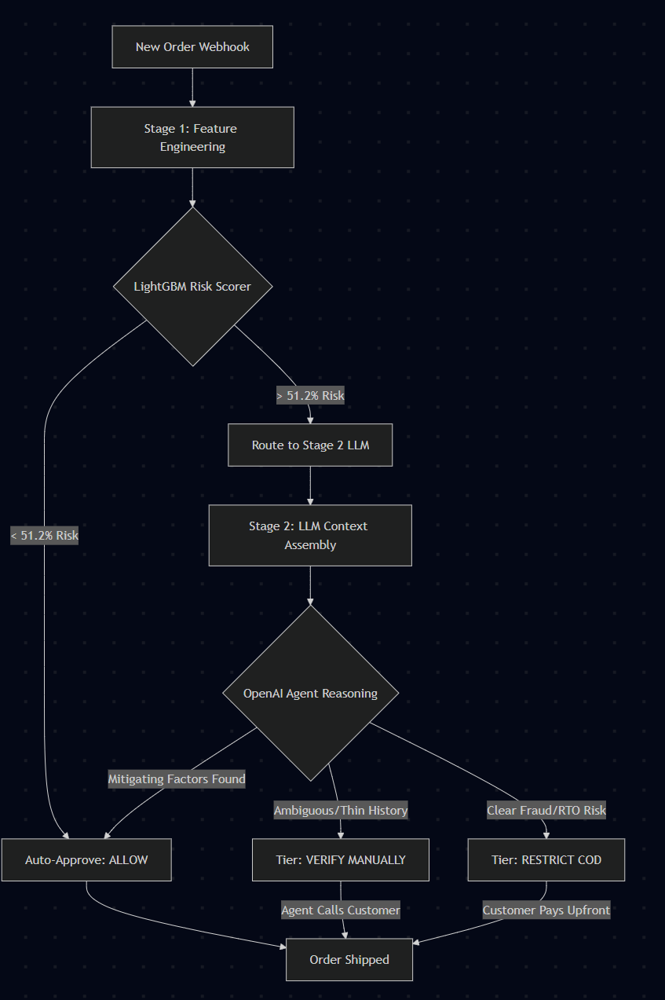
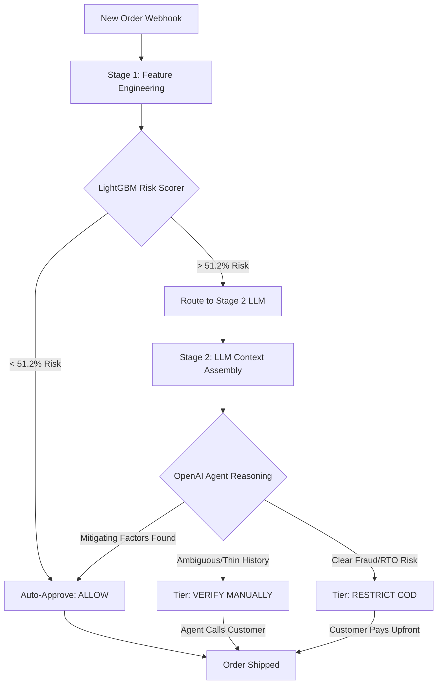

# Architecture

Guardian follows a two-stage hybrid pipeline to balance cost, latency, and reasoning capability:

<b>View Mermaid Source Code</b>

### Why a Two-Stage Pipeline?
1. **Cost & Latency:** Running an LLM on 10,000 orders a day is extremely expensive and slow. Stage 1 (LightGBM) acts as a high-speed, ultra-cheap filter, automatically approving the bottom ~80% of safe traffic in milliseconds.
2. **Nuance & Reasoning:** For the highly suspicious top 20%, binary ML models often lack the context to understand edge cases (e.g., sample sizes of `n=1` or how a Prepaid method mitigates RTO risk). Stage 2 uses OpenAI's reasoning capabilities to analyze these edge cases like a human fraud analyst, reducing false positives.
